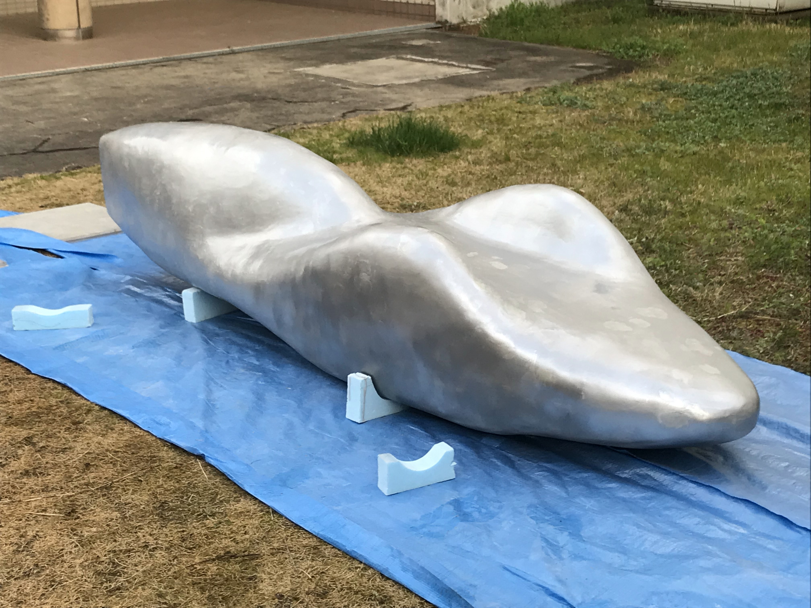

# ecorun_project

明石高専のエコラン/エネルギーマネジメント系車両プロジェクトに関する、設計資料・引継ぎ資料・大会準備資料・写真記録をまとめたアーカイブです。一般的なソフトウェア開発リポジトリというより、2019年前後から2022年頃にかけて蓄積された車両開発ドキュメント集に近い構成になっています。

このリポジトリには、Honda Eco Mileage Challenge 系の低燃費車両と、`Ene-1` 系の電動車両について、以下のような資料が含まれます。

- 車両フレーム、ステアリング、後輪まわり、カウルなどのCADデータ
- 静解析・構造検討・寸法検討・軽量化検討のための資料
- 加工・組立・走行練習・大会準備の手順書
- 会議メモ、引継ぎ資料、写真・動画による製作記録
- センサ計測やログ取得に関する小規模なArduinoスケッチ

## 写真

### Ene-1車両フレーム

### エコラン車両の完成状態

### カウル製作中の記録

## このリポジトリでわかること

- 車両開発が、設計、解析、加工、組立、試走、大会準備まで一連の流れで管理されていたこと
- ステアリング角度やフレーム構成を検討しながら、SolidWorksベースで試作を重ねていたこと
- カウル製作や治具加工の現場写真が残っており、製造プロセスの追跡が可能なこと
- 走行練習や大会前会議のメモから、班ごとの作業分担と当日の運用課題を確認できること
- `datelog.ino` から、センサ入力をSDカードへ保存する簡易ロガーも使われていたこと

## 主なディレクトリ

### `EcoRun ~2021/`
2020-2021年前後のエコラン車両資料です。フレーム案、過去車両の設計データ、シャシダイナモ関連ファイル、図面、参照資料、ステアリングまわりのCADなどが含まれます。`datelog/datelog.ino` には、センサ入力をSDカードへ保存するArduino用スケッチがあります。

### `Ene-1 ~2021/`
Ene-1車両に関する設計・加工・解析・参考資料のまとまりです。フレーム、後輪チーム部品、ステアリングキャスター角の検討、モータードライバ関連資料、解析スクリーンショット、車両写真などが整理されています。

### `Ecorun 2022/`
2022年の設計データ群で、次期フレーム初号機に関するSolidWorks部品や解析関連ファイルが保存されています。車両設計の継続検討フェーズを示すディレクトリです。

### `エコランまとめ/`
活動全体の横断的なまとめです。会議議事録、予定表、大会関係資料、練習走行資料、車両取扱資料、動画編集素材、写真・動画が含まれており、設計以外の運営面も追えます。議事録には、班別の進捗、走行練習で見つかった問題点、翌日の作業計画などが記録されています。

### `引継ぎ資料まとめ秋元/`
引継ぎ用に整理された資料群です。テキストの説明ファイルからも、2018-2020の資料、CAD使用方法、FI資料、プロジェクトマネージャ向け資料、設計関係、加工機の使い方が体系的に整理されていることがわかります。ステアリング設計やキャスター角検討の議論ログも含まれています。

### `mosaic/`
製作工程やイベント時の写真アーカイブです。カウル製作、校内活動、大会、展示、他車両観察など、現場の様子を視覚的に追える資料が中心です。

## 代表的な資料

- `EcoRun ~2021/datelog/datelog.ino`
  - センサ入力の時間差を計測し、`DATELOG*.TXT` としてSDカードへ書き出すArduinoスケッチです。
- `引継ぎ資料まとめ秋元/引継ぎ資料記載内容.txt`
  - 引継ぎ資料全体の分類と意図を説明する索引の役割を持つテキストです。
- `引継ぎ資料まとめ秋元/設計関係/ステアリング/ステアリング設計.txt`
  - ステアリング、キャンバー、キャスター角に関する検討・相談の記録です。
- `エコランまとめ/3,議事録/2021.6/20210609会議.txt`
  - フレーム、エンジン、カウル、FIなど各班の進捗、走行練習で見つかった問題、翌日の作業計画がまとまっています。

## 公開説明から除外したもの

このREADMEでは、以下のような公開に向かない情報は内容説明の対象から外しています。

- 個人を特定しうる名簿、学生証画像、連絡先、提出用書類
- 保険、申請、誓約、承諾などの対外提出書類
- 個人名や個人識別情報を含む写真・スキャン画像
- 学内運営上の詳細情報で、一般公開が前提ではないもの

リポジトリ全体を外部公開する場合は、READMEだけでなく、実ファイル自体についても別途スクリーニングすることを前提にしてください。

## 補足

本リポジトリはコード中心ではなく、写真、PDF、Office文書、SolidWorks関連ファイルが多数を占めます。設計履歴と活動記録を横断して確認したい場合に有用なアーカイブです。
